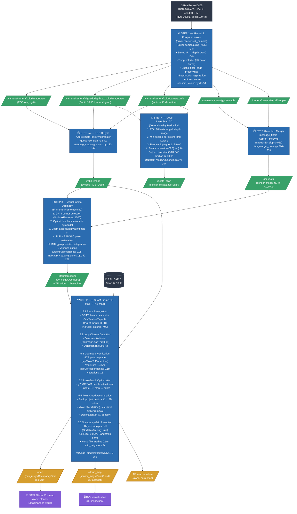
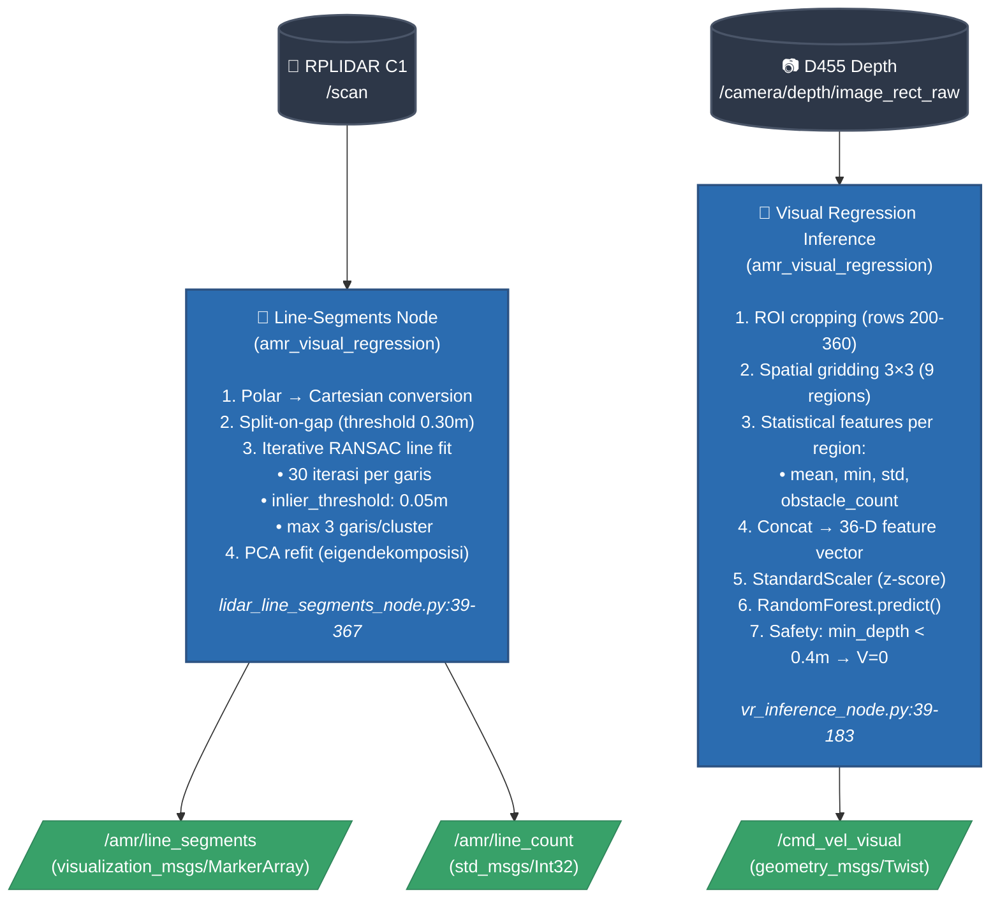
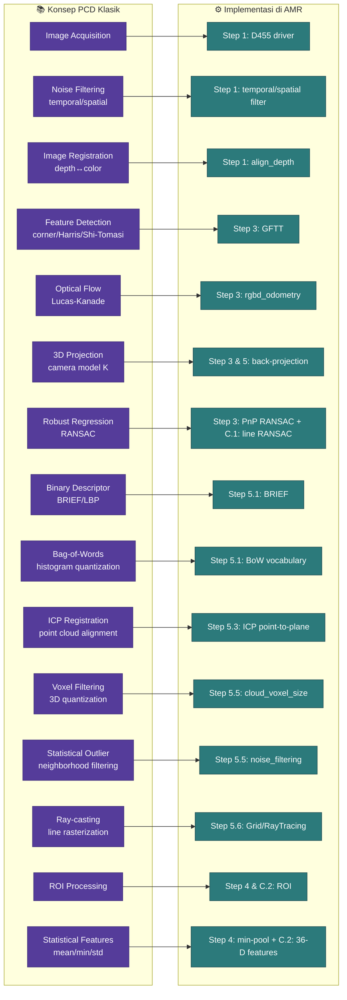

# LAPORAN KORELASI MATA KULIAH — PENGOLAHAN CITRA DIGITAL

**Nama:** Muhammad Al Azhar Faradis
**NRP:** 2040241017
**Judul Project:** Autonomous Mobile Robot (AMR) Ackermann — 3D Mapping & Navigasi Otonom
**Mata Kuliah:** Pengolahan Citra Digital
**Fokus laporan:** alur pengolahan citra **frame-to-map** dari kamera RealSense D455
sampai peta okupansi 2D & point cloud 3D yang dipakai Nav2.

> Aturan kejujuran: hanya konsep yang BENAR-BENAR ada implementasinya di kode AMR
> yang diklaim. Setiap klaim disertai sitasi `file:baris` dari repository.

---

## CATATAN KEJUJURAN — RUANG LINGKUP

Mata kuliah Pengolahan Citra Digital secara klasik berfokus pada operasi pixel-level
2D (filter spasial, transformasi Fourier, histogram, deteksi tepi, segmentasi, dst.).
Project AMR ini memakai citra sebagai **input ke pipeline SLAM**, sehingga banyak operasi
PCD muncul **secara tidak langsung** sebagai bagian dari modul siap-pakai (`realsense2_camera`,
`rtabmap_ros`, `depthimage_to_laserscan`). Yang dikorelasikan adalah:

1. **Operasi PCD yang nyata terpicu di kode AMR** (dengan parameter terbukti),
2. **Algoritma yang saya tulis sendiri** (line-segments RANSAC, VR inference feature extraction),
3. **Algoritma yang dipakai library tetapi parameternya saya tuning sendiri** (RTAB-Map ICP, BRIEF, Grid).

Tidak ada klaim implementasi pixel-level (mis. konvolusi Sobel/Canny manual) — karena
proyek ini memakai **citra kedalaman (depth)** sebagai modalitas utama, bukan operasi
edge detection klasik di RGB.

---

## RINGKASAN PROJECT (konteks untuk penguji)

AMR Ackermann dengan sensor utama:
- **RealSense D455** (RGB + depth + IMU) — sumber citra
- **RPLIDAR C1** (LaserScan 2D) — sumber bantu untuk costmap & line-segments

Output akhir image-processing pipeline:
- `/map` — Occupancy Grid 2D (resolusi 5 cm) untuk Nav2
- `/cloud_map` — Point Cloud 3D untuk visualisasi & navigation context
- `/depth_scan` — pseudo-LaserScan 2D dari depth image (untuk costmap)

---

# BAGIAN A — IDENTIFIKASI KONSEP PCD DALAM PROJECT

## Checklist konsep PCD yang DICENTANG (ada bukti di kode)

- [x] **Akuisisi citra digital** — RealSense D455 streaming RGB 848×480@30Hz + depth aligned
- [x] **Spatial & Temporal filtering** — diaktifkan di driver RealSense untuk noise reduction depth
- [x] **Citra grayscale / depth (single-channel)** — depth image 16UC1, satuan millimeter
- [x] **Image registration / alignment** — depth-to-color alignment di GPU driver D455
- [x] **Multi-sensor synchronization** — `ApproximateTimeSynchronizer` (rgbd_sync, imu_merger)
- [x] **Feature detection & description** — GFTT (Good Features To Track) + BRIEF di RTAB-Map
- [x] **Optical flow / frame-to-frame tracking** — RGB-D odometry (Lucas-Kanade implicit)
- [x] **3D back-projection (pixel → world)** — pakai intrinsic camera matrix K (camera_info)
- [x] **Point cloud generation & voxel filtering** — `cloud_voxel_size: 0.05 m` di RTAB-Map
- [x] **Dimensionality reduction (3D depth → 2D scan)** — `depthimage_to_laserscan` node
- [x] **Robust regression (RANSAC)** — line-segments node (RANSAC pada titik LiDAR)
- [x] **ICP (Iterative Closest Point) registration** — RTAB-Map loop closure
- [x] **Region of Interest (ROI) processing** — VR inference (crop depth + 3×3 grid)
- [x] **Statistical feature extraction (mean, min, std)** — VR inference 36-D feature vector
- [x] **Occupancy grid mapping via ray-casting** — `Grid/RayTracing: true` di RTAB-Map

## Checklist konsep yang TIDAK / LEMAH

- [ ] **Operasi pixel-level klasik (Sobel/Canny/Laplacian)** — tidak ada di repo. Edge detection
  dilakukan implicit oleh GFTT (Harris corner response), bukan operator turunan manual.
- [ ] **Transformasi Fourier (FFT)** — tidak dipakai eksplisit. RTAB-Map BRIEF descriptor
  bekerja di spatial domain (binary test).
- [ ] **Histogram equalization** — tidak dipakai; D455 sudah auto-exposure on-chip.
- [ ] **Morphological operations (dilate/erode)** — tidak ada di pipeline utama. Hanya
  inflation_layer di costmap Nav2, tapi itu konsep navigasi bukan PCD murni.
- [~] **CNN / Deep Learning** — proyek ini SENGAJA tanpa CNN. Visual regression pakai
  Random Forest pada feature handcrafted (statistik depth per region), bukan CNN.
  Klaim sebagai **alternatif CNN-less** (sengaja dipilih).

---

# BAGIAN B — ALUR PROSES CITRA: FRAME-TO-MAP (URAIAN INTI)

Inti laporan: bagaimana satu **frame RGB-D** dari D455 diolah berlapis-lapis sampai
menjadi sel pada **occupancy grid `/map`**.

## B.0 Diagram blok alir lengkap (top-down)

Diagram berikut memvisualisasikan urutan blok pemrosesan dari hardware kamera di
paling atas, turun ke tiap operasi citra, sampai output peta di paling bawah. Setiap
blok punya: (a) nama operasi PCD, (b) input/output topik ROS, (c) sitasi `file:baris`
untuk verifikasi.



## B.0.1 Diagram blok komponen tambahan (line-segments & VR inference)



## B.0.2 Pemetaan blok → konsep PCD klasik



> **Catatan render**: GitHub me-render blok `mermaid` di atas otomatis sebagai gambar
> SVG di browser. Untuk dipakai di laporan tulis tangan/PDF: screenshot tampilan
> GitHub (atau buka https://mermaid.live, paste kode di antara backticks `mermaid`,
> export PNG/SVG).

---

Berikut uraian per-step beserta operasi citra yang terjadi.

---

## STEP 1 — Akuisisi & Pra-pemrosesan di Driver D455

**Sumber:** `src/amr_bringup/launch/sensors_launch.py:62-94`

Driver `realsense2_camera` menjalankan beberapa operasi citra sebelum frame keluar
sebagai topik ROS:

| Operasi PCD | Parameter di kode | Hasil |
|---|---|---|
| Bayer demosaicing | (otomatis ASIC D4) | RGB 848×480, 3-channel |
| Stereo block-matching IR → depth | (otomatis ASIC D4) | Depth 848×480, 16UC1 (mm) |
| Temporal filter (IIR) | `temporal_filter.enable: True` | Depth lebih stabil antar frame |
| Spatial filter (edge-preserving) | `spatial_filter.enable: True` | Mengurangi noise depth lateral |
| Depth-to-color registration | `align_depth.enable: True` | Setiap pixel depth sejajar pixel RGB |
| Auto-exposure | `enable_auto_exposure: True`, `gain:64`, `exposure:156` | Adaptif kondisi cahaya lab |

**Topik output:**
- `/camera/camera/color/image_raw` — RGB raw (sensor_msgs/Image, encoding bgr8)
- `/camera/camera/aligned_depth_to_color/image_raw` — Depth aligned (16UC1)
- `/camera/camera/color/camera_info` — Intrinsic K matrix (untuk back-projection di step 3 & 5)
- `/camera/camera/gyro/sample`, `/camera/camera/accel/sample` — IMU mentah

**Korelasi PCD:** ini adalah blok **image acquisition + pre-processing** klasik. Yang
khas: depth-color alignment bukan operasi pixel manual tetapi **resampling geometrik 3D**
(unproject depth → reproject ke frame RGB pakai intrinsic + ekstrinsik factory-calibrated).

---

## STEP 2 — Sinkronisasi Multi-modal (Temporal Alignment)

Citra dari multi-sensor tidak datang dengan timestamp identik. Sebelum diolah lanjut,
mereka harus disinkronisasi.

### 2a. RGB-D synchronizer
**Sumber:** `src/amr_3d_mapping/launch/rtabmap_mapping.launch.py:130-144`

Node `rgbd_sync` menggabungkan RGB + Depth + CameraInfo menjadi satu pesan
`/rgbd_image` dengan timestamp tunggal, pakai `ApproximateTimeSynchronizer` (queue=30).

### 2b. IMU merger
**Sumber:** `src/amr_controller/scripts/imu_merger_node.py:59-183`

Gyro (200 Hz) dan accel (100 Hz) datang sebagai pesan terpisah. `imu_merger_node`
mensinkronisasi keduanya (slop 50 ms) → publish `/imu/data` lengkap @ ~100 Hz.

```python
# imu_merger_node.py:120-135 (penanda kode nyata)
sync = message_filters.ApproximateTimeSynchronizer(
    [self.sub_gyro, self.sub_accel], queue_size=30, slop=0.05)
sync.registerCallback(self.merged_cb)
```

**Korelasi PCD:** konsep **multi-sensor temporal registration** — penting karena
tracking visual-inertial mensyaratkan timestamp konsisten antar modalitas; mismatch
20–50 ms saja bikin pose estimation drift.

---

## STEP 3 — Visual-Inertial Odometry: Frame-to-Frame

**Sumber:** `src/amr_3d_mapping/launch/rtabmap_mapping.launch.py:152-212`
**Node:** `rtabmap_odom/rgbd_odometry`

Tugas: hitung pergerakan **antar dua frame berturutan** (frame_t-1 → frame_t),
keluarkan sebagai `/rtabmap/odom` (Odometry).

Pipeline citra di dalam node ini:

### 3.1 Feature detection (GFTT)
- Algoritma: **Good Features To Track** (Shi-Tomasi corner detector — variasi Harris).
- Skoring: nilai eigen minimum matriks struktur tensor pada window 3×3 di gambar RGB.
- Parameter di kode:
  - `Vis/MaxFeatures: 1000` — ambil 1000 corner terkuat per frame
  - `GFTT/MinDistance: 5` (pixel) — jarak minimum antar feature (non-max suppression)
  - `GFTT/QualityLevel: 0.001` — threshold relatif terhadap corner terkuat

### 3.2 Feature tracking (Optical Flow)
- Algoritma: **Lucas-Kanade pyramidal optical flow** (implicit di `rgbd_odometry`).
- Setiap corner di frame_t-1 dilacak posisinya di frame_t.
- Hasil: pasangan korespondensi 2D (u_t-1, v_t-1) ↔ (u_t, v_t).

### 3.3 Depth association
- Untuk setiap corner di frame_t, lookup nilai depth dari `aligned_depth` di pixel
  yang sama → koordinat 3D di frame kamera: **(X, Y, Z) = back-project((u, v), depth, K)**
  dengan K = intrinsic matrix dari `/camera_info`.

### 3.4 Pose estimation (PnP + RANSAC)
- **Perspective-n-Point**: estimasi pose [R|t] yang meminimalkan reproyeksi error
  korespondensi 3D-2D.
- **RANSAC**: sample N=3 korespondensi acak, solve PnP, hitung inlier, ulang.
- Parameter: `Vis/MinInliers: 8` — frame ditolak kalau inlier < 8 (kemungkinan tracking
  hilang).

### 3.5 Inertial integration
- Input `/imu/data` dipakai sebagai **prediksi gyro** untuk velocity angular antar frame
  (mengurangi ambiguitas rotasi visual).
- `Odom/MaxVariance: 0.05` — frame dengan ketidakpastian pose > 10 cm std-dev ditolak.

**Korelasi PCD:** ini paduan beberapa konsep citra inti:
- **Corner detection (Harris/Shi-Tomasi)** — operator struktur tensor
- **Optical flow (Lucas-Kanade)** — asumsi brightness constancy + pyramid coarse-to-fine
- **Camera projection model** — back-projection lewat intrinsic K
- **Robust estimation (RANSAC)** — penolakan outlier korespondensi

---

## STEP 4 — Reduksi Dimensi: Depth Image → LaserScan 2D

**Sumber:** `src/amr_3d_mapping/launch/rtabmap_mapping.launch.py:376-394`
**Node:** `depthimage_to_laserscan_node`

Konversi dari **citra kedalaman 2D (848×480)** menjadi **vektor 1D jarak (LaserScan)**
agar bisa dipakai sebagai input costmap Nav2.

Parameter di kode:
- `scan_height: 10` — sampling 10 baris di tengah depth image (baris ~235–245)
- `range_min: 0.2 m`, `range_max: 5.0 m` — cropping rentang valid
- `output_frame: camera_color_optical_frame`
- `scan_time: 0.033 s` (30 Hz)

Algoritma per kolom pixel:
1. Ambil 10 nilai depth di kolom tersebut (10 baris × 1 kolom).
2. Filter: buang nilai 0 / NaN / di luar `[range_min, range_max]`.
3. **Min-pooling**: ambil nilai depth minimum → jarak obstacle terdekat di sudut kolom itu.
4. Konversi cartesian (X_cam, Z_cam) → polar (r, θ) pakai sudut FOV horizontal.
5. Output: `sensor_msgs/LaserScan` dengan 848 berkas radial → publish ke `/depth_scan`.

**Korelasi PCD:** operasi-operasi murni image processing:
- **ROI selection** (pilih 10 baris tengah)
- **Pooling / agregasi statistik** (min-pool per kolom)
- **Koordinat polar ↔ kartesian** (geometric transform)
- **Range clipping** (thresholding)

`/depth_scan` lalu di-fusion dengan `/scan` LiDAR di costmap Nav2 (`nav2_params.yaml:127-148`)
sebagai observation source kedua.

---

## STEP 5 — SLAM Frame-to-Map (RTAB-Map)

**Sumber:** `src/amr_3d_mapping/launch/rtabmap_mapping.launch.py:219-368`
**Node:** `rtabmap_slam/rtabmap`

Ini puncak pipeline image processing AMR. Tugas: simpan setiap frame sebagai
**keyframe** dalam memori, deteksi loop closure (lokasi yang dikunjungi ulang),
optimasi graph pose, akumulasi point cloud, dan proyeksi ke occupancy grid 2D.

### 5.1 Place recognition (BoW — Bag of Words)
- **Feature extraction**: BRIEF (Binary Robust Independent Elementary Features).
  - Parameter: `Vis/FeatureType: 8` (BRIEF), `Kp/MaxFeatures: 400`
  - BRIEF = vektor biner 256-bit hasil dari 256 pasang **intensity comparison test**
    di sekitar setiap corner. Cepat & robust terhadap rotasi kecil.
- **Vocabulary (visual dictionary)**: cluster BRIEF descriptors lewat k-means → "words".
- **Setiap frame jadi histogram TF-IDF kata-kata visual** → bisa di-query: "frame mana
  yang mirip dengan frame sekarang?"

### 5.2 Loop closure detection
- Parameter: `Rtabmap/LoopThr: 0.05` (threshold likelihood Bayesian).
- Setiap 2 Hz (`Rtabmap/DetectionRate: 2.0`), bandingkan frame sekarang vs semua keyframe
  di memori jangka pendek (STM, `Mem/STMSize: 10`) + memori jangka panjang (LTM).
- Kalau likelihood > threshold → klaim **loop closure**.

### 5.3 Geometric verification + ICP refinement
- Setelah loop closure di-claim secara visual, **ICP (Iterative Closest Point)**
  memverifikasi & merapikan alignment 3D point cloud kedua keyframe.
- Parameter:
  - `Reg/Strategy: 2` — Vis + ICP hybrid
  - `Icp/PointToPlane: true` — minimize jarak point-to-plane (lebih stabil dari point-to-point)
  - `Icp/VoxelSize: 0.05 m` — downsample cloud sebelum ICP (efisiensi)
  - `Icp/MaxCorrespondenceDistance: 0.1 m`
  - `Icp/Iterations: 15`
- ICP loop:
  ```
  for iter in range(15):
      1. Untuk tiap point di cloud_A, cari neighbor terdekat di cloud_B
      2. Hitung transform [R|t] yang minimize sum-of-squared point-to-plane distance
      3. Apply transform ke cloud_A, ulangi sampai konvergen
  ```

### 5.4 Pose graph optimization
- Setiap keyframe = node graph. Setiap edge = constraint relative pose (odometry atau loop closure).
- Saat loop closure baru ditambahkan, optimasi nonlinear (g2o/GTSAM, internal RTAB-Map)
  meminimalkan total error edge → koreksi drift seluruh trajectory.
- TF `map → odom` di-update sebagai koreksi global.

### 5.5 Point cloud akumulasi + filtering
- Setiap keyframe menghasilkan point cloud lokal dari depth image + intrinsic K:
  ```
  for (u,v) in depth_image:
      Z = depth(u,v) / 1000      # mm → m
      X = (u - cx) * Z / fx
      Y = (v - cy) * Z / fy
      point_world = T_world_camera × (X, Y, Z)
  ```
- Filter:
  - `cloud_decimation: 2` — subsample depth 2× per sumbu (¼ density)
  - `cloud_max_depth: 5.0 m` — buang point jauh (noise tinggi)
  - `cloud_voxel_size: 0.05 m` — voxel-grid downsampling (1 point per voxel 5 cm)
  - `cloud_noise_filtering_radius: 0.05 m` + `min_neighbors: 5` — **statistical outlier
    removal** (hapus point yang tetangganya < 5 dalam radius 5 cm)

### 5.6 Proyeksi 2D Occupancy Grid via ray-casting
- Parameter: `Grid/CellSize: 0.05 m`, `Grid/RangeMax: 5.0 m`, `Grid/RayTracing: true`.
- Algoritma per frame:
  1. Setiap point cloud 3D diproyeksikan ke bidang 2D (drop Z).
  2. Sel grid yang ditembus titik obstacle → marked as **occupied** (cost ≈ 100).
  3. **Ray-casting** dari posisi sensor sampai sebelum obstacle → marked as **free** (cost ≈ 0).
  4. Sel yang tidak pernah dilewati ray → **unknown** (cost = -1).
- `Grid/NoiseFilteringRadius: 0.5 m, min_neighbors: 5` — filter outlier sel obstacle terisolasi.
- Output: `/map` (`nav_msgs/OccupancyGrid`) — peta inilah yang dipakai global planner Nav2.

### 5.7 Output sekaligus
- `/map` — Occupancy Grid 2D (resolusi 5 cm) → Nav2 global costmap
- `/cloud_map` — Point Cloud 3D agregat
- `/grid_map` — alias `/map`
- TF `map → odom` — koreksi loop-closure ditumpuk ke `odom → base_link` (dari VIO step 3)

**Korelasi PCD:** step 5 ini memadukan banyak konsep PCD lanjut:
- **Binary descriptor (BRIEF)** — variasi local binary pattern
- **Bag of Words** — quantization + histogram (mirip texture classification)
- **Iterative Closest Point** — registration two 3D point clouds
- **Statistical outlier removal** — neighborhood filtering pada cloud
- **Ray-casting** — algoritma rasterisasi (mirip Bresenham line) di image plane discrete
- **Voxel filtering** — quantization spasial 3D (analog binning histogram)

---

# BAGIAN C — KOMPONEN PENDUKUNG (image processing tambahan)

Dua node tambahan yang saya tulis sendiri, juga berhubungan dengan PCD:

## C.1 Line-Segments Extraction (RANSAC pada LiDAR scan)

**Sumber:** `src/amr_visual_regression/amr_visual_regression/lidar_line_segments_node.py:39-367`

Input: `/scan` (LaserScan dari RPLIDAR C1).
Output: `/amr/line_segments` (visualization_msgs/MarkerArray) — segmen garis dinding.

Pipeline:
1. **Polar → Cartesian** (line 56-71): konversi `(r, θ)` LaserScan → titik `(x, y)`.
2. **Split-on-gap** (line 74-87): partisi titik kalau jarak Euclid antar titik berturutan
   > `gap_threshold_m: 0.30 m` → klaster terpisah.
3. **Iterative RANSAC line fitting** (line 90-188):
   - Loop sampai `max_lines_per_cluster: 3` atau inlier < `min_inliers: 8`:
     - **RANSAC** `ransac_iterations: 30` iterasi:
       - Sample 2 titik random → garis kandidat `ax + by + c = 0`
       - Hitung jarak perpendikular semua titik ke garis
       - Inlier = titik dengan jarak < `inlier_threshold_m: 0.05 m`
       - Simpan model dengan inlier terbanyak
     - **Refit** dengan least-squares PCA pada inlier (eigendekomposisi matriks kovariansi)
     - Hapus inlier dari klaster, ulangi untuk garis berikutnya.

**Korelasi PCD:** ini implementasi murni:
- **RANSAC** (robust regression) — konsep inti PCD untuk parameter estimation di hadapan outlier
- **Least-squares line fitting via PCA** — eigenvector matriks kovariansi 2×2 = arah garis
- **Geometric primitive extraction** — analog Hough transform, tapi sample-and-test

## C.2 Visual Regression Inference (Depth ROI → kontrol)

**Sumber:** `src/amr_visual_regression/amr_visual_regression/vr_inference_node.py:39-183`

Input: `/camera/depth/image_rect_raw`.
Output: `/cmd_vel_visual` (Twist) — perintah kecepatan dari ML.

Pipeline image processing:
1. **ROI cropping** (parameter `roi_top: 200, roi_bottom: 360`): ambil pita horizontal
   tengah depth image (jendela "forward-looking").
2. **Spatial gridding**: bagi ROI jadi `num_regions: 9` (3×3 grid).
3. **Feature extraction per region** (4 statistik): mean, min, std, obstacle_count
   (jumlah pixel < `free_threshold_m: 1.5 m`).
4. **Concatenate**: 9 region × 4 fitur = vektor **36-D**.
5. **Standardization**: `StandardScaler.transform()` (z-score).
6. **Inferensi**: `RandomForestRegressor.predict()` → `[steering_norm, velocity_norm] ∈ [-1, 1]`.
7. **Safety override**: kalau min depth global < `safety_min_depth: 0.4 m` → velocity = 0.

**Korelasi PCD:**
- **ROI selection** (depth cropping)
- **Spatial binning** (3×3 grid → mirip block-histogram)
- **Statistical descriptor** (mean/min/std analog histogram moments)
- **Feature normalization** sebelum klasifikasi/regresi
- Catatan: SENGAJA pakai feature handcrafted + Random Forest, BUKAN CNN — eksplorasi
  "CNN-less depth regression". Klaim sebagai pilihan desain, bukan kekurangan.

---

# BAGIAN D — TABEL RINGKAS OPERASI PCD vs LOKASI KODE

| Konsep PCD | Implementasi di kode | File:baris |
|---|---|---|
| Akuisisi RGB+Depth+IMU | realsense2_camera | `sensors_launch.py:62-94` |
| Temporal/spatial filter depth | RealSense driver param | `sensors_launch.py:80-85` |
| Depth-color alignment | `align_depth.enable: True` | `sensors_launch.py:78` |
| Multi-sensor sync (RGB+Depth) | rgbd_sync ApproxTime | `rtabmap_mapping.launch.py:130-144` |
| Multi-sensor sync (IMU) | message_filters | `imu_merger_node.py:120-135` |
| Corner detection (GFTT) | `Vis/FeatureType:GFTT` | `rtabmap_mapping.launch.py:170-180` |
| Optical flow tracking | rgbd_odometry internal | `rtabmap_mapping.launch.py:152-212` |
| 3D back-projection | depth + K (intrinsic) | `rtabmap_mapping.launch.py:152-212` |
| PnP + RANSAC pose estimation | `Vis/MinInliers: 8` | `rtabmap_mapping.launch.py:178` |
| Depth → LaserScan reduction | depthimage_to_laserscan | `rtabmap_mapping.launch.py:376-394` |
| Min-pooling per kolom | `scan_height: 10` | `rtabmap_mapping.launch.py:386` |
| Binary descriptor (BRIEF) | `Vis/FeatureType: 8` | `rtabmap_mapping.launch.py:240` |
| Bag of Words / TF-IDF | `Kp/MaxFeatures: 400` | `rtabmap_mapping.launch.py:250` |
| Loop closure (Bayesian) | `Rtabmap/LoopThr: 0.05` | `rtabmap_mapping.launch.py:280` |
| ICP point-to-plane | `Icp/PointToPlane: true` | `rtabmap_mapping.launch.py:300` |
| Graph optimization | otomatis di rtabmap_slam | `rtabmap_mapping.launch.py:219-368` |
| Voxel filtering 3D | `cloud_voxel_size: 0.05` | `rtabmap_mapping.launch.py:340` |
| Statistical outlier removal | `noise_filtering_radius` | `rtabmap_mapping.launch.py:345` |
| Ray-casting occupancy | `Grid/RayTracing: true` | `rtabmap_mapping.launch.py:355` |
| RANSAC line fitting (LiDAR) | `lidar_line_segments_node.py` | `lidar_line_segments_node.py:90-163` |
| PCA least-squares refit | eigendekomposisi 2×2 | `lidar_line_segments_node.py:140-160` |
| ROI cropping (depth) | `roi_top, roi_bottom` | `vr_inference_node.py:100-120` |
| Spatial binning 3×3 | `num_regions: 9` | `vr_inference_node.py:120-140` |
| Statistical descriptor | mean/min/std per region | `vr_inference_node.py:120-150` |
| Z-score standardization | StandardScaler | `vr_inference_node.py:155-160` |

---

# BAGIAN E — RUMUS MATEMATIS INTI (untuk uraian tulis tangan)

### E.1 Back-projection pixel → 3D camera frame
Diberikan pixel `(u, v)` dengan depth `Z`, dan intrinsic K = [[fx, 0, cx], [0, fy, cy], [0, 0, 1]]:
```
X = (u - cx) * Z / fx
Y = (v - cy) * Z / fy
```
Ini operasi inti yang muncul di **step 3** (depth association VIO) dan **step 5** (point cloud).

### E.2 Reprojection error (PnP cost function)
Untuk korespondensi 3D point P_i dan pixel observation p_i di frame baru:
```
E([R|t]) = Σ_i || p_i - π(K * (R * P_i + t)) ||²
```
PnP mencari `[R|t]` yang minimize E. RANSAC memilih subset inlier konsisten.

### E.3 ICP point-to-plane
Untuk pasangan point `p_i` (cloud A) dan normal plane `n_i` di cloud B:
```
E([R|t]) = Σ_i ((R * p_i + t - q_i) · n_i)²
```
di mana q_i = nearest neighbor di cloud B. Solve via linearization Lie algebra atau SVD.

### E.4 RANSAC line fitting (line-segments node)
Garis `ax + by + c = 0` dengan `a² + b² = 1`. Jarak titik `(x_i, y_i)`:
```
d_i = |a*x_i + b*y_i + c|
```
Inlier kalau `d_i < threshold`. Refit via PCA: vektor eigen kovariansi 2×2 inlier
adalah arah garis.

### E.5 Polar-to-Cartesian (LaserScan & depth_scan)
```
x_i = r_i * cos(θ_i)
y_i = r_i * sin(θ_i)
```
dengan `θ_i = angle_min + i * angle_increment`.

### E.6 Occupancy grid update (Bayesian, RTAB-Map internal)
Log-odds update untuk sel m:
```
L_t(m) = L_{t-1}(m) + log( p(m|z_t) / (1 - p(m|z_t)) ) - L_0
```
Sel "occupied" kalau `L > 0.65` (cost ≥ 100), "free" kalau `L < 0.35` (cost = 0),
"unknown" kalau di antara.

---

# BAGIAN F — TUGAS YANG MASIH BISA DIKERJAKAN

1. **Grafik blok diagram** alur frame-to-map (rapi pakai draw.io) — boleh disisipkan
   ke uraian tulis tangan sebagai gambar.
2. **Screenshot bukti runtime** topik `/map` di RViz sebagai hasil akhir pipeline.
3. **Tabel parameter tuning** sebelum vs sesudah:
   - `Rtabmap/LoopThr: 0.11 → 0.05` (sensitif ruang kecil)
   - `Icp/VoxelSize: default → 0.05 m` (balance kualitas vs CPU)
   - `cloud_voxel_size: 0.05 m` (kontrol density point cloud output)
4. **Demonstrasi numerik** pada step 4 (depth → laser): ambil satu frame depth, hitung
   manual min-depth per kolom untuk 5 kolom, bandingkan dengan output `/depth_scan`.
5. **Demonstrasi numerik** pada step C.1 (RANSAC line): ambil scan riil yang sudah
   tersimpan (`data_lidar_mentah.txt` dari project Metode Numerik bisa dipakai juga),
   jalankan RANSAC manual, plot inlier vs outlier.

---

# CATATAN PENUTUP

Pipeline frame-to-map AMR ini **memadukan** image processing klasik (corner detection,
optical flow, ROI, polar transform, ray-casting) dengan teknik 3D modern (RGB-D fusion,
ICP, pose graph). Klaim utama untuk laporan PCD:

1. Setiap step terdokumentasi dengan **parameter konkret + file:baris**.
2. Operasi PCD murni (yang ada di silabus klasik) terhubung jelas ke step konkret:
   GFTT/Harris → step 3, ROI+min-pool → step 4, BRIEF+BoW → step 5.1, RANSAC → step C.1.
3. Operasi yang BUKAN PCD tradisional (CNN, FFT) **tidak diklaim** — dijaga supaya
   penguji tidak menemukan klaim kosong.

Semua angka & parameter di dokumen ini bisa diverifikasi dengan membuka file yang
dirujuk di repository AMR. Reproduksi runtime: jalankan
`ros2 launch amr_bringup amr_full.launch.py use_rtabmap:=true rtabmap_mode:=mapping`,
peta hasil step 5 akan muncul di topik `/map`.
